<!--
  ============================================================
  GITHUB PROFILE README  ·  cressagasti-gif  ·  Gastón Cressa
  Theme: Acer Nitro (rojo / negro)
  ------------------------------------------------------------
  · assets/matrix-rain.svg y los emblemas son SVG propios
    (ver gen_assets.py). GitHub los anima porque los referencia
    con ruta relativa y los sirve vía raw.githubusercontent.
  · Las tarjetas externas son SVG animadas de CDNs públicos.
  ============================================================
-->

<p align="center">
  
</p>

<p align="center">
  
</p>

<br>

<p align="center">
  
  
  
  
</p>

---

## 👨‍💻 About Me

- 🔧 **IT Technician & Programmer at Syscom Computers** — technical support, PC repair and maintenance, OS installation, PC assembly, software installation and remote assistance.
- 🌐 Also handle **basic networking and CCTV systems**, supporting customers with hardware and software solutions.
- 🎓 Studied **Data Science, AI, Programming and Data Analysis** at Instituto Cervantes.
- 🌱 Currently pushing into **AI / Machine Learning** and applying my studies to real data problems.
- 🚀 **Goal:** keep growing in tech and land a role where I can put my skills to work.

---

## 🛠️ Tech Stack

<p align="center">
  
</p>

<p align="center">
  
  
  
  
  
  
  
</p>

<p align="center">
  
  
  
</p>

---

## 📊 GitHub Stats

<p align="center">
  
  
</p>

<p align="center">
  
</p>

---

## 💼 What I do at Syscom Computers

| Area | Tasks |
|---|---|
| **Technical support** | Remote assistance and on-site troubleshooting for customers |
| **Hardware** | PC assembly, diagnostics, repair and component replacement |
| **Systems** | Operating system installation, drivers and software deployment |
| **Maintenance** | Preventive maintenance and performance tuning |
| **Networks & CCTV** | Basic networking setup and camera system installation |
| **Solutions** | Advising customers on the hardware/software that fits their needs |

---

## 📂 Projects

| Repository | Description |
|---|---|
| **`USAF-DATA-ANALYSIS`** | Power BI project visualising data and tastes around USAF / Navy aviation. |
| **`USAF-proyecto-IA-DATA-BASE`** | Python / notebook database with curated data on USAF aircraft models. |
| **`Proyecto-POWER-BI`** | Sales analysis of electronics & home appliances by store and zone over time. |
| **`F1-DATA-2`** | Python simulation of an F1 driver registry with statistics and wins. |
| **`Proyecto-IA`** | Small artificial intelligence programming project. |
| **`Proyecto-DATA`** | Data science project / relational database. |

---

## 🎓 Education

**Instituto Cervantes** — Data Science · Artificial Intelligence · Programming · Data Analysis

---

## 📫 Let's connect

<p align="center">
  <a href="https://www.linkedin.com/in/gaston-cressa-9ba539250/"> </a>
  <a href="https://www.instagram.com/gasti_98x/"> </a>
  <a href="https://github.com/cressagasti-gif"></a>
</p>

---

```text
  ██╗   ██╗████████╗ ██████╗  ██████╗
  ██║   ██║╚══██╔══╝██╔═══██╗██╔═══██╗
  ██║   ██║   ██║   ██║   ██║██║   ██║
  ╚██╗ ██╔╝   ██║   ██║   ██║██║   ██║
   ╚████╔╝    ██║   ╚█████╔╝╚█████╔╝
    ╚═══╝     ╚═╝    ╚════╝  ╚════╝
```

<p align="center">
  <sub>Matrix rain &amp; emblems: <code>gen_assets.py</code> · Cards: <a href="https://github.com/DenverCoder1/readme-typing-svg">readme-typing-svg</a> · <a href="https://github.com/anuraghazra/github-readme-stats">github-readme-stats</a> · <a href="https://github.com/DenverCoder1/github-readme-streak-stats">streak-stats</a> · <a href="https://github.com/tandpfun/skillicons">skillicons</a></sub>
</p>
